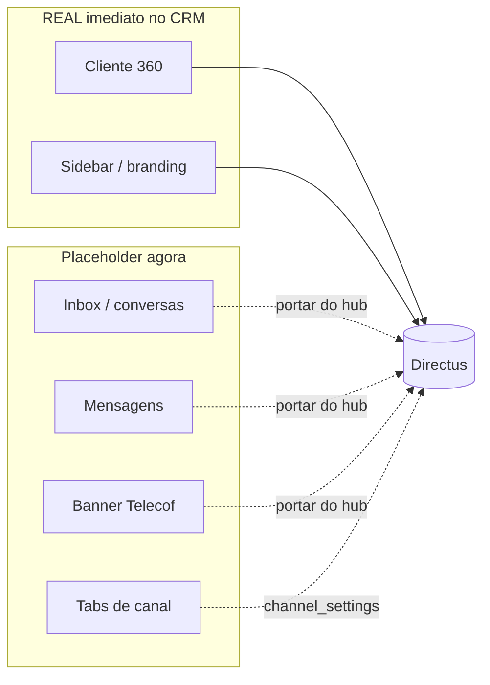

# Fase 0 — Plano de Implementação (CRM + HubChat unificado)

> Documento de **fecho da Fase 0** do `ROADMAP.md`. Define como aplicar o **Hotelequip Design System** ao `crm-lab-directus` (dados reais) e como portar a inbox operacional do `hotelequip-communication-hub`, **sem ainda alterar código** (conforme decisão **D10**: fechar UX/plano antes de tocar no código).

## Contexto e princípios

- **Base de implementação:** `crm-lab-directus` — é o repositório com dados reais ligados ao Directus e a porta de entrada principal (decisões **D01** e **D03**).
- **Fonte de design:** `Hotelequip Design System` (`colors_and_type.css` + `ui_kits/hubchat/*`) — linguagem visual oficial: sidebar escura, verde de marca, tipografia Geist, Telecof como banner.
- **Motor de comunicações:** `hotelequip-communication-hub` — fornece a lógica WhatsApp (Evolution/n8n) e Telecof já testada.
- **Telecof:** canal de primeira classe, apresentado como banner/popup (decisão **D05**).
- **BravoTech:** fallback temporário, a substituir gradualmente (decisão **D06**).

Convenção de caminhos: por nome de repositório/ficheiro (ex.: `design-system/colors_and_type.css`, `crm-lab-directus/src/index.css`, `communication-hub/src/components/...`).

---

## PARTE 1 — Mapa de tokens

**Origem:** `design-system/colors_and_type.css` (valores em HEX)
**Destino:** `crm-lab-directus/src/index.css` (`:root` e `.dark`, valores em **HSL**) + `crm-lab-directus/tailwind.config.ts` (referências `hsl(var(--x))`)

O CRM usa tokens HSL; o design system usa HEX. O mapa converte HEX → HSL e indica exatamente o que muda e para quê.

### 1A. Tokens que MUDAM de valor

| Token (CRM) | Valor atual | Novo valor | HEX | Para quê |
|---|---|---|---|---|
| `--primary` | `217 91% 60%` (azul) | `142 76% 36%` | `#16a34a` | Verde de marca: CTAs, botão enviar, realce primário |
| `--accent` | `217 91% 60%` | `142 76% 36%` | `#16a34a` | Realce passa a verde |
| `--ring` | `217 91% 60%` | `142 76% 36%` | `#16a34a` | Anel de foco verde |
| `--sidebar-primary` | `217 91% 60%` | `142 76% 36%` | `#16a34a` | Pip/item ativo na sidebar a verde |
| Fonte (sans) | `Inter` | `Geist` | — | `@import` no topo de `src/index.css` + `fontFamily.sans` em `tailwind.config.ts` |
| Fonte (mono) | (não existe) | `Geist Mono` | — | Adicionar `fontFamily.mono` para IDs, valores `€`, telefones |

Nota sobre raio: `--radius` no CRM é `0.5rem` (8px); o default do design system é `6px` (`--r-md`, com `8px` reservado a painéis/modais). **Decisão:** manter `0.5rem` no CRM para minimizar disrupção; documentado como escolha consciente.

### 1B. Tokens que JÁ COINCIDEM (sem alteração)

| Token (CRM) | Valor | Equivalente no Design System |
|---|---|---|
| `--sidebar-background` | `222 47% 11%` | `--bg-sidebar` `#0f172a` (igual) |
| `--success` | `142 76% 36%` | brand green / `--state-atendimento` `#16a34a` (igual) |
| `--warning` | `38 92% 50%` | `--state-pendente` `#f59e0b` (igual) |
| `--background` | `0 0% 98%` | `--bg-canvas` `#f8fafc` (diferença mínima; opcional alinhar para `210 40% 98%`) |

Conclusão: a sidebar escura e o verde de marca **já existem** no CRM — a repaginação é menos disruptiva do que aparenta.

### 1C. Tokens NOVOS a adicionar (não existem no CRM)

**Canais (load-bearing — significado, não decoração):**

| Token | HEX | HSL (a usar no CRM) | Canal |
|---|---|---|---|
| `--ch-wa1` | `#25D366` | `142 70% 49%` | WhatsApp linha 1 |
| `--ch-wa2` | `#128C7E` | `173 77% 31%` | WhatsApp linha 2 |
| `--ch-tel` | `#F97316` | `25 95% 53%` | Telecof (telefonia) |
| `--ch-ai` | `#8B5CF6` | `258 90% 66%` | Ask Me (IA interna) |
| `--ch-ig` | `#E1306C` | `338 74% 54%` | Instagram |
| `--ch-fb` | `#1877F2` | `214 89% 52%` | Facebook |

**Estados de conversa (borda esquerda 3px):**

| Token | HEX | HSL | Estado |
|---|---|---|---|
| `--state-atendimento` | `#16a34a` | `142 76% 36%` | Em atendimento (verde) |
| `--state-urgente` | `#dc2626` | `0 72% 51%` | Urgente (vermelho) |
| `--state-ia` | `#8b5cf6` | `258 90% 66%` | IA ativa (roxo) |
| `--state-pendente` | `#f59e0b` | `38 92% 50%` | Pendente (âmbar) |

**Tintas e bolhas de mensagem:**

| Token | Valor | Uso |
|---|---|---|
| `--note-yellow` | `#FEF9C3` | Fundo da nota interna |
| `--note-yellow-bd` | `#FACC15` | Borda da nota interna |
| `--ai-suggest` | `#FEF3C7` | Fundo da sugestão IA |
| `--ai-suggest-bd` | `#F59E0B` | Borda da sugestão IA |
| `--tint-ia` | `rgba(139,92,246,0.08)` | Fundo da barra "IA insight" |

**Em `tailwind.config.ts`:** adicionar as famílias de cor
`colors.channel.{wa1,wa2,tel,ai,ig,fb}` e `colors.state.{atendimento,urgente,ia,pendente}`
mapeadas para os novos vars, mais `fontFamily.mono: ['Geist Mono', 'ui-monospace', ...]`.

**Animação:** o CRM já tem `pulse-slow` em `src/index.css` (`@keyframes pulse-slow` + `.animate-pulse-slow`), equivalente ao pulse do banner Telecof do design system. **Reutilizar** em vez de criar nova.

---

## PARTE 2 — Mapa de componentes

Origem: `design-system/ui_kits/hubchat/*`. Para cada componente: equivalente no CRM, equivalente no hub e recomendação (**Portar do hub** / **Adaptar existente** / **Criar novo**).

### `Sidebar.jsx` — rail escuro 200px (CRM / Comunicações / Sistema)
- **CRM:** `crm-lab-directus/src/components/layout/AppSidebar.tsx` (já escura, 13 itens, logo via `useSettings`)
- **Hub:** `communication-hub/src/components/sidebar/Sidebar.tsx` (rail 64px só ícones)
- **Recomendação: ADAPTAR** o `AppSidebar.tsx` do CRM (já tem dados reais + dark). Aplicar agrupamento `CRM / Comunicações / Sistema`, badges e tokens novos.

### `Topbar.jsx` — barra 56px (pesquisa, agente, trigger Telecof)
- **CRM:** não há topbar dedicada (cada página tem o seu header); `QuickActions.tsx` aproxima-se da ideia de ações rápidas.
- **Hub:** não há topbar global.
- **Recomendação: CRIAR NOVO** em `crm-lab-directus/src/components/layout/` (pesquisa global + menu do agente + botão "Simular Telecof").

### `Inbox.jsx` — coluna 240px (pesquisa + tabs de canal + filtros + lista)
- **CRM:** `crm-lab-directus/src/components/communications/ComunicacoesChannelsSidebar.tsx` (apenas selector de canais decorativo).
- **Hub:** `communication-hub/src/components/inbox/InboxLeftColumn.tsx` + `inbox/InboxFiltersBar.tsx` + `conversations/ConversationList.tsx` + `conversations/ConversationItem.tsx` (lógica de filtros real).
- **Recomendação: PORTAR** a estrutura do hub (`InboxLeftColumn` + `ConversationList` + `ConversationItem`) para o CRM, com o visual do design system (tabs de canal coloridas, filter pills, borda de estado 3px).

### `ConversationView.jsx` — header + barra IA + stream + composer
- **CRM:** não existe; o centro de `/comunicacoes` é o iframe `crm-lab-directus/src/components/communications/BravoTechEmbed.tsx`.
- **Hub:** composto por `chat/ChatHeader.tsx` + `chat/MessageList.tsx` + `chat/MessageBubble.tsx` + `chat/MessageContent.tsx` + `chat/MessageInput.tsx`.
- **Recomendação: PORTAR** do hub (ChatHeader / MessageList / MessageBubble / MessageInput) com skin do design system. Substitui o iframe BravoTech (**D06**).

### `Client360.jsx` — painel 220px (tabs Perfil / Histórico / Negócios + score IA + ações)
- **CRM:** `crm-lab-directus/src/components/communications/ComunicacoesCliente360Panel.tsx` + `components/contacts/CustomerTimeline.tsx` (dados reais).
- **Hub:** `communication-hub/src/components/customer/CustomerPanel.tsx`.
- **Recomendação: ADAPTAR** o do CRM (`ComunicacoesCliente360Panel` + `CustomerTimeline`) — já liga a dados reais. Aplicar layout de tabs e tokens do design system.

### `Telecof.jsx` — banner amarelo com pulse (auto-dismiss 45s, "Atender + ficha" / "Rejeitar")
- **CRM:** `crm-lab-directus/src/components/LeadPopup360.tsx` (popup com timer 18s) — padrão de timer/ações reutilizável.
- **Hub:** `communication-hub/src/components/telecof/*` + `customer/TelecofCustomerPanel.tsx`.
- **Recomendação: CRIAR NOVO** banner global em `crm-lab-directus/src/components/communications/`, montado no `AppLayout.tsx`, reaproveitando o timer/estrutura do `LeadPopup360.tsx`. Aparece por cima de qualquer ecrã, sem mudar de página.

### `App.jsx` — wiring (conversa selecionada, painel aberto, chamada)
- **CRM:** `crm-lab-directus/src/components/layout/AppLayout.tsx` (shell + Wavoip + sidebar + bottom nav).
- **Hub:** `communication-hub/src/layouts/AppLayout.tsx`.
- **Recomendação: ADAPTAR** o `AppLayout.tsx` do CRM como shell de 3 zonas; orquestrar o estado da inbox na página `crm-lab-directus/src/pages/Comunicacoes.tsx`.

### Resumo das decisões de componente

| Componente DS | Decisão | Onde |
|---|---|---|
| Sidebar | Adaptar | `crm-lab-directus` AppSidebar |
| Topbar | Criar novo | `crm-lab-directus` layout |
| Inbox | Portar (do hub) | InboxLeftColumn + ConversationList |
| ConversationView | Portar (do hub) | ChatHeader + MessageList + MessageInput |
| Client360 | Adaptar | `crm-lab-directus` ComunicacoesCliente360Panel + CustomerTimeline |
| Telecof | Criar novo | banner global no AppLayout |
| App (shell) | Adaptar | `crm-lab-directus` AppLayout + Comunicacoes |

---

## PARTE 3 — Ligação ao Directus real vs placeholder

Para cada peça a construir: coleção Directus que a alimenta, existência de hook no `crm-lab-directus` e se é implementação **real imediata** ou pode ficar **placeholder** por agora.

| Peça (componente) | Coleção Directus | Hook no CRM? | Estado |
|---|---|---|---|
| Inbox / lista de conversas (`Inbox`, `ConversationList`) | `conversations` | **NÃO** — só no hub (`communication-hub/src/integrations/directus/conversations.ts` + `useConversationPolling`) | **PLACEHOLDER** primeiro (mock), depois **REAL** portando o cliente do hub (Fase 2/3) |
| Stream de mensagens (`ConversationView`, `MessageList`) | `messages` (conversation_messages) | **NÃO** — hub: `useMessagePolling` | **PLACEHOLDER** primeiro; **REAL** na onda de integração |
| Composer / envio (`MessageInput`) | `messages` + saída via Evolution/n8n | **NÃO** — hub: `services/whatsappOutboundMessage.ts`, `sendEvolutionMessage.ts` | **PLACEHOLDER** (escreve local); **REAL** depende de env Evolution/n8n |
| Banner Telecof (`Telecof`) | `communication_events` (channel=telecof) | **NÃO** — hub: `integrations/directus/communicationEvents.ts` + `useTelecofCallsPolling`. CRM tem `useLeadListener360` (exclui Telecof de propósito) | **PLACEHOLDER** (botão "Simular Telecof") primeiro; **REAL** via polling depois (**D05**) |
| Tabs/cores de canal (`Inbox` channel tabs) | `channel_settings` | **NÃO** | **PLACEHOLDER** (cores fixas dos tokens do DS); **REAL** depois |
| Cliente 360 — Perfil/Contacto (`Client360`) | `contacts` | **SIM** (`useContacts`, `use-contact-by-id`, `integrations/directus/contacts.ts`) | **REAL imediato** |
| Cliente 360 — Histórico/Timeline | `interactions` + `follow_ups` | **SIM** (`useInteractions`, `useFollowUps`, `CustomerTimeline.tsx`) | **REAL imediato** |
| Cliente 360 — Negócios (tab Negócios) | `deals` + `quotations` | **SIM** (`useDeals`, `useQuotations`) | **REAL imediato** (WooCommerce/Moloni ficam placeholder — em revisão no roadmap) |
| Sidebar — logo/branding | `company_settings` | **SIM** (`useSettings`) | **REAL imediato** |
| Topbar — pesquisa global | `contacts` (+ `conversations` futuro) | **PARCIAL** (`useContacts`, `useMeilisearch`) | **REAL** para contactos; conversas placeholder |

### Resumo da estratégia (alinhado a D01 / D03 / D05 / D06 e Roadmap Fase 0 → 3)

- **REAL desde já:** tudo o que é Cliente 360 (contactos, timeline, negócios) + sidebar/branding. São as colunas que já têm hooks Directus no CRM.
- **PLACEHOLDER agora, REAL na integração:** toda a camada de inbox (`conversations`, `messages`, `communication_events`, `channel_settings`), que exige **portar o cliente Directus + polling do hub** para o CRM.

---

## Nota de conformidade

Este documento **não altera** `tailwind.config.ts`, `src/index.css`, nem qualquer componente. É o artefacto de fecho da Fase 0 (decisão **D10**: UX e plano antes de código). As alterações de código descritas acima só arrancam após aprovação para iniciar a Fase 1/2/3.
