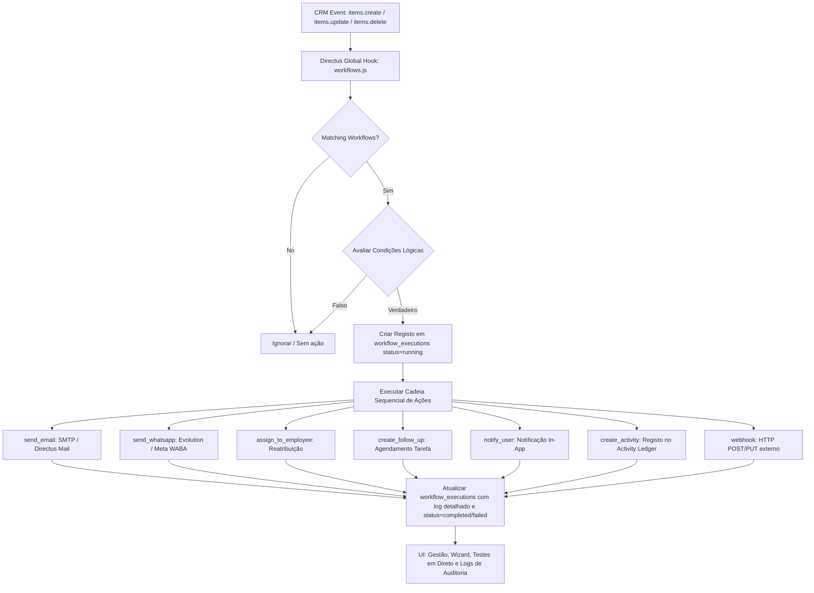

# Automação de Workflows (If-This-Then-That)

Sistema completo de **Visual Workflow Automation** integrado com o **Directus Backend** e a interface de utilizador do CRM.

---

## 1. Arquitetura do Sistema

---

## 2. Modelo de Dados Directus

### Coleção `workflows`

| Campo | Tipo | Descrição |
|---|---|---|
| `id` | UUID (PK) | Identificador único do workflow |
| `name` | String | Nome identificativo da automação |
| `description` | Text (nullable) | Descrição do objetivo do workflow |
| `trigger_collection` | String | Coleção monitorizada (`leads`, `deals`, `contacts`, `quotations`, `follow_ups`, `activity`) |
| `trigger_event` | String (Enum) | Evento gatilho (`create`, `update`, `delete`, `stage_changed`, `no_followup_days`) |
| `trigger_conditions` | JSONB | Array de regras de condição: `[{ field, op, value }]` |
| `actions` | JSONB | Array de passos de ação: `[{ id, type, params }]` |
| `is_active` | Boolean | Estado de ativação (default: `true`) |
| `created_by` | UUID (FK) | Utilizador Directus criador |
| `date_created` | Timestamp | Data de criação |
| `date_updated` | Timestamp | Data de última atualização |

**Índices:**
- `(is_active)`
- `(trigger_collection, trigger_event)`
- `(created_by)`

---

### Coleção `workflow_executions`

| Campo | Tipo | Descrição |
|---|---|---|
| `id` | UUID (PK) | Identificador único da execução |
| `workflow_id` | UUID (FK) | Chave estrangeira para o workflow |
| `trigger_item_id` | String | ID do item que despoletou o workflow |
| `status` | String (Enum) | `pending`, `running`, `completed`, `failed` |
| `started_at` | Timestamp | Data e hora de início da execução |
| `completed_at` | Timestamp (nullable) | Data e hora de conclusão |
| `log` | JSONB | Array de logs por passo: `[{ step, action_type, status, message, result, timestamp }]` |
| `error` | Text (nullable) | Mensagem de erro em caso de falha |
| `date_created` | Timestamp | Data de criação do registo de log |

**Índices:**
- `(workflow_id, started_at DESC)`
- `(status)`
- `(trigger_item_id)`

---

## 3. Gatilhos (Triggers) Suportados

1. **`create`**: Disparado assim que um novo registo é criado na coleção selecionada.
2. **`update`**: Disparado quando qualquer campo de um registo existente é atualizado.
3. **`stage_changed`**: Disparado especificamente quando os campos de fase (`stage_id`, `stage`, `status`, `pipeline_stage_id`) sofrem alterações.
4. **`no_followup_days`**: Disparado quando um registo permanece sem atividade de acompanhamento durante X dias.
5. **`delete`**: Disparado antes/depois da remoção de um registo.

---

## 4. Operadores de Condição

O motor avalia o conjunto de condições (`_and` lógico). Operadores disponíveis:

- `_eq` / `==` / `equals`: Igualdade de valores.
- `_neq` / `!=` / `not_equals`: Diferença de valores.
- `_gt` / `>`: Maior que.
- `_gte` / `>=`: Maior ou igual a.
- `_lt` / `<`: Menor que.
- `_lte` / `<=`: Menor ou igual a.
- `_contains` / `_icontains`: Contém substring (case-insensitive).
- `_null`: Campo vazio ou nulo.
- `_nnull`: Campo preenchido e não nulo.
- `_in`: Valor presente numa lista separada por vírgulas.
- `_nin`: Valor não presente na lista.
- `stage_changed`: Valida se o campo sofreu alteração no payload.

---

## 5. Ações Suportadas

O motor suporta 7 tipos de ações sequenciais:

1. **`send_email`**:
   - Parâmetros: `to`, `subject`, `body` (HTML ou texto).
   - Suporta variáveis dinâmicas (`{{email}}`, `{{contact_name}}`, etc.).
   - Utiliza Directus MailService / SMTP de `company_settings` / `/email-send`.

2. **`send_whatsapp`**:
   - Parâmetros: `to`, `message`, `instance_id` (opcional).
   - Integração com instâncias Evolution API / Meta Cloud WABA (Card 14) / `wa-proxy`.

3. **`assign_to_employee`**:
   - Parâmetros: `employee_id`, `collection` (opcional).
   - Atualiza `assigned_to_employee_id` / `assigned_employee_id`.

4. **`create_follow_up`**:
   - Parâmetros: `title`, `type` (`call`, `email`, `whatsapp`, `task`), `due_in_days`, `notes`, `assigned_employee_id`.
   - Criação automática de registo na coleção `follow_ups` com vínculo ao contacto/deal/lead.

5. **`notify_user`**:
   - Parâmetros: `user_id`, `title`, `message`.
   - Dispara notificação in-app (`directus_notifications`) e alerta no centro de notificações.

6. **`create_activity`**:
   - Parâmetros: `activity_type`, `channel`, `summary`, `status`, `payload`.
   - Insere evento unificado na tabela append-only `activity` (Activity Ledger).

7. **`webhook`**:
   - Parâmetros: `url`, `method` (`POST`, `PUT`, `GET`), `headers`, `payload`.
   - Envio assíncrono com timeout e captura de resposta HTTP.

---

## 6. Interpolação de Variáveis Dinâmicas

Qualquer campo de texto (assuntos, corpos de mensagem, URLs, títulos) suporta interpolação no formato `{{campo}}`:

- `{{id}}` - Identificador do registo
- `{{company_name}}` - Nome da empresa / cliente
- `{{contact_name}}` / `{{first_name}}` / `{{last_name}}` - Nome do contacto
- `{{email}}` - Endereço de email do registo
- `{{phone}}` / `{{whatsapp_number}}` - Telefone/WhatsApp
- `{{status}}` - Estado atual
- `{{stage}}` - Etapa do pipeline
- `{{total_amount}}` - Valor monetário

---

## 7. Interface de Utilizador (UI)

Acessível em `/definicoes/workflows` e no menu Mais:

- **Estatísticas Rápidas**: Total de automações, workflows ativos, contagem de execuções e taxa de sucesso global.
- **Lista de Cards**:
  - Badge visual de estado (Ativo / Pausado).
  - Resumo de Trigger (IF) e Ações (THEN).
  - Switch de ativação instantânea.
  - Botão de teste rápido com execução simulada em direto.
- **Assistente Wizard de 4 Passos**:
  - **Passo 1**: Seleção de Coleção, Evento e Construtor de Condições.
  - **Passo 2**: Editor avançado de Ações com **Drag-and-Drop** (`@hello-pangea/dnd`) para reordenação da sequência.
  - **Passo 3**: Teste com Item Real (validação com payload JSON antes de publicar).
  - **Passo 4**: Resumo e Ativação.
- **Separador de Execuções e Auditoria**:
  - Tabela filtrável por workflow.
  - Polling automático a cada 30 segundos (`useWorkflowExecutions`).
  - Painel expansível com detalhes de cada passo executado e mensagens de erro.

---

## 8. Exemplo de Verificação

### Workflow: "Lead com 7 dias sem follow-up -> Notificar manager"

1. **Trigger**: Coleção `leads`, Evento `no_followup_days`.
2. **Condições**: `status != 'converted'`, `status != 'lost'`.
3. **Ações**:
   - Passo 1: `notify_user` -> Destinatário: Gestor / Manager ("Atenção: Lead sem contacto há mais de 7 dias").
   - Passo 2: `create_follow_up` -> Tipo: Chamada urgente, Vencimento: +1 dia.
   - Passo 3: `create_activity` -> Canal: Sistema, Resumo: "Alerta automático de inatividade registado".
4. **Resultado de Execução**: Registo gerado em `workflow_executions` com `status=completed` e 3 passos com status `success`.
